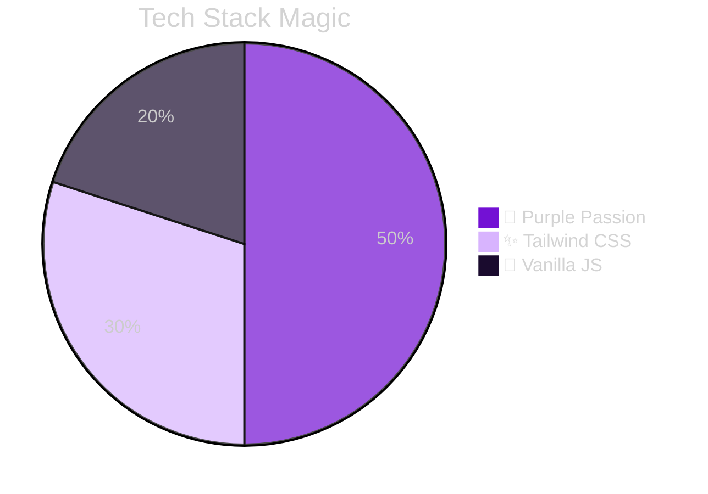
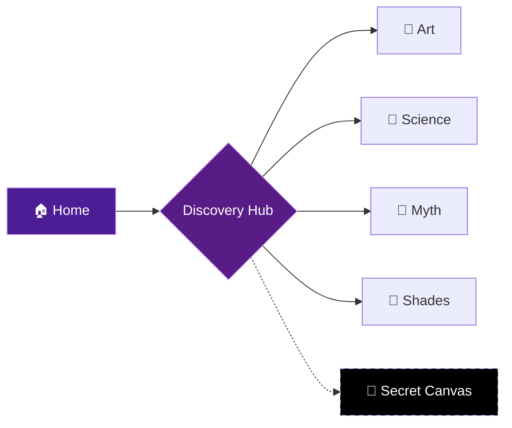

# 💜 Amethystiee
**A Digital Love Letter to the Color Purple**

## 👋 What is this?
**Amethystiee** is a fun, creative website purely dedicated to exploring the color purple. It’s an interactive experience built to look beautiful and feel "alive" with neon lights and glass effects.
## ✨ Cool Stuff Inside
*   **🎨 Neon Art Gallery**: Cyberpunk art displayed on frosted glass.
*   **🧪 Science Lab**: Mix light to creating purple & extensive color theory.
*   **📖 Mythic Library**: Listen to folklore or write and save your own stories.
*   **🤫 Hidden Drawing App**: Find the secret button to paint with neon brushes!
*   **💎 Spectral Archive**: Browse purple shades and copy Hex codes instantly.
## 🛠️ Built With
*   **HTML5**
*   **Tailwind CSS** (Custom Dark Mode & Animations)
*   **Vanilla JavaScript** (No frameworks needed!)
## 🚀 How to Explore
1.  Open `index.html` in your browser.
2.  Go to **Discovery** to browse all sections.
3.  Look for the tiny star `⋆˚꩜｡`... clicking it unlocks the secret drawing tool!
---

*Made with 💜 by Sanduni Basnayaka*
